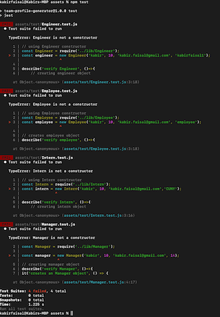
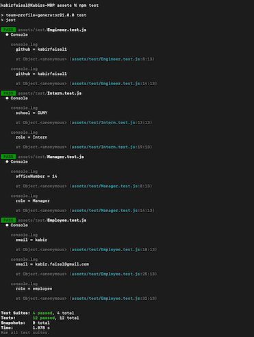

# Team Profile Generator
This is a  Node.js command-line application that takes in information about employees on a software engineering team and generates an HTML webpage that displays summaries for each person. This project demonstrates use of OOP and TDD using Jest. 
# Table-of-Contents
  * [Deployed URL](#deployed-url)
  * [Dependency](#dependency)
  * [UserStory](#userstory)
  * [Acceptance Criteria](#acceptance-criteria)
  * [Application Invoked](#application-invoked)
  * [Test Invoked](#test-invoked)
  * [Test Case](#test-case)
  * [Screenshots](#screenshots)
    * [TDD](#tdd)
    * [Inquire Display](#inquire-display)
  * [Nice to Have](#nice-to-have)
 
## [Deployed URL](#table-of-contents)
```
    TBD
```
## [Dependency](#table-of-contents)
```
    1. node.js (npm install -g npm) on your system
    2. npm i inquirer@8.2.4 (on the project)
```
## [User Story](#table-of-contents)
```
AS A manager
I WANT to generate a webpage that displays my team's basic info
SO THAT I have quick access to their emails and GitHub profiles
```

## [Acceptance Criteria](#table-of-contents)
```
GIVEN a command-line application that accepts user input
WHEN I am prompted for my team members and their information
THEN an HTML file is generated that displays a nicely formatted team roster based on user input
WHEN I click on an email address in the HTML
THEN my default email program opens and populates the TO field of the email with the address
WHEN I click on the GitHub username
THEN that GitHub profile opens in a new tab
WHEN I start the application
THEN I am prompted to enter the team manager’s name, employee ID, email address, and office number
WHEN I enter the team manager’s name, employee ID, email address, and office number
THEN I am presented with a menu with the option to add an engineer or an intern or to finish building my team
WHEN I select the engineer option
THEN I am prompted to enter the engineer’s name, ID, email, and GitHub username, and I am taken back to the menu
WHEN I select the intern option
THEN I am prompted to enter the intern’s name, ID, email, and school, and I am taken back to the menu
WHEN I decide to finish building my team
THEN I exit the application, and the HTML is generated
```

## [Application Invoked](#table-of-contents)
```
node [your node app]
or
nodemon [your node app]
```
## [Test Invoked](#table-of-contents)
```
npm [your test file]
```

## [Test Case](#table-of-contents)
1. Verify manager enter their name, ID, Email
2. Verify manager enter their name, ID, invalid Email
3. Verify manager failed to enter their name, id or email
4. Verify manager entered employee/inters name all information's 
5. Verify manager failed to enter employee gitHub
6. Verify manager did select yes to add another employee
7. Verify manager did not select yes to add another employee

## [Screenshots](#table-of-contents)
### [TDD](#table-of-contents)
1. Before building the constructor 



2. After building the constructor 



### [Inquire Display](#table-of-contents)
<!--  -->
